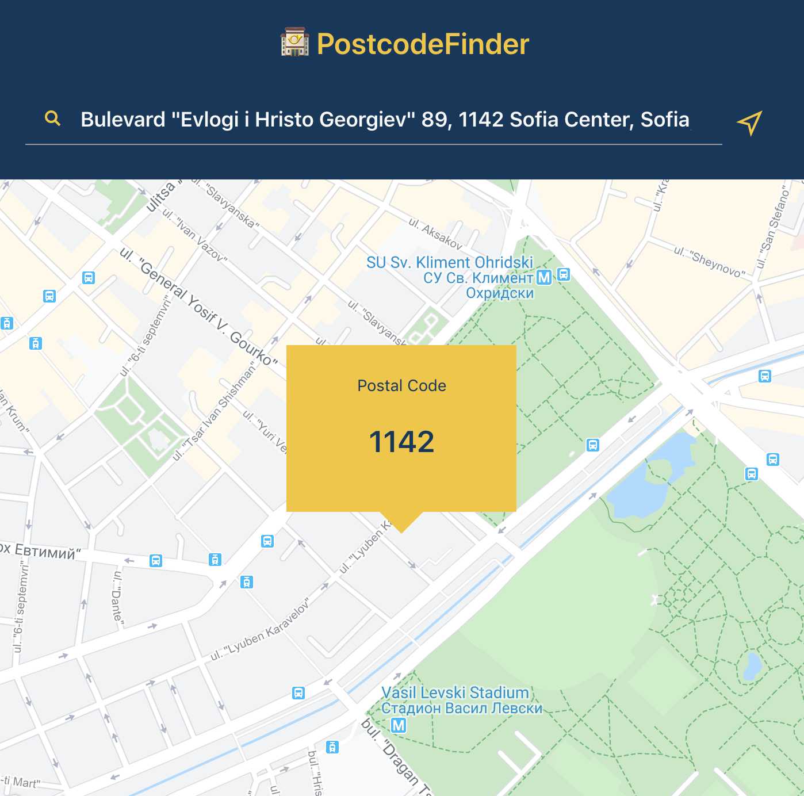

# postcode-finder

## Features

- Find the postal code for a given address
- Find the postal code at the current device geolocation
- See the postal code positioned on a map
- Share or bookmark the postal code result page
